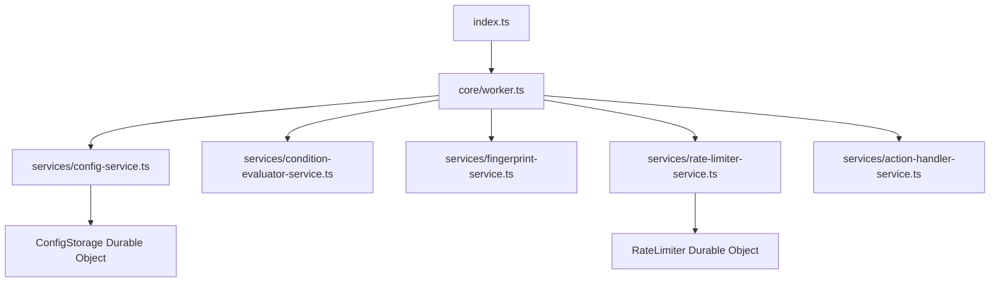
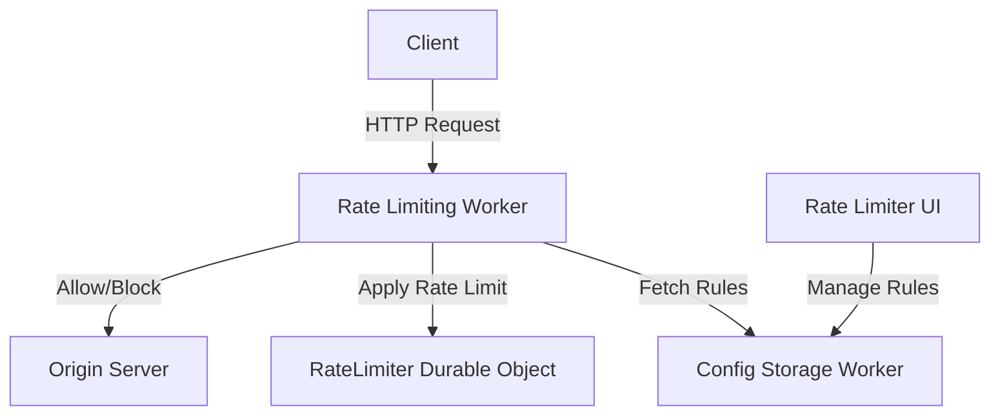
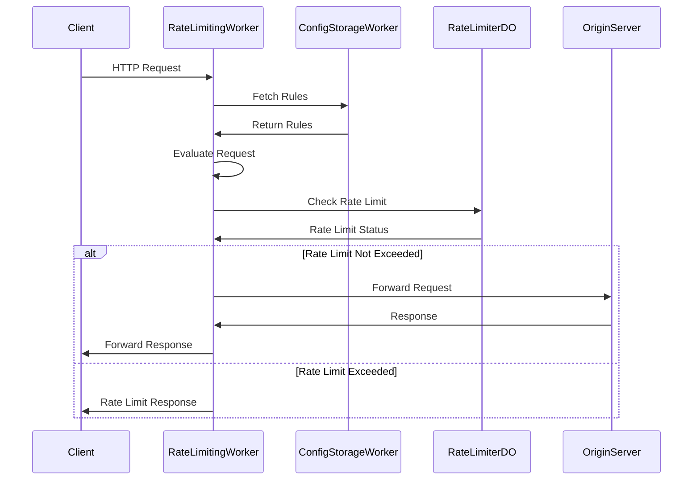

# Rate Limiting Worker

## Table of Contents
1. [Overview](#overview)
2. [Project Structure](#project-structure)
3. [Key Components](#key-components)
4. [System Architecture](#system-architecture)
5. [Workflow](#workflow)
6. [Rate Limiting Logic](#rate-limiting-logic)
7. [Configuration](#configuration)
8. [API Endpoints](#api-endpoints)
9. [Durable Objects](#durable-objects)
10. [Development](#development)
11. [Deployment](#deployment)
12. [Testing](#testing)
13. [Error Handling and Logging](#error-handling-and-logging)
14. [Security Considerations](#security-considerations)
15. [Limitations](#limitations)
16. [Future Improvements](#future-improvements)
17. [Related Components](#related-components)

## Overview

The Rate Limiting Worker is a Cloudflare Worker designed to implement rate limiting based on configurable rules. It works in conjunction with the Rate Limit Configurator UI and Config Storage Worker, fetching rules from a shared Durable Object and applying them to incoming requests.

## Project Structure

The project now follows a modular architecture:

```
src/
├── constants/           # Application constants and configuration
├── core/                # Core application logic
├── services/            # Business logic services
│   ├── action-handler-service.ts
│   ├── condition-evaluator-service.ts
│   ├── config-service.ts
│   ├── fingerprint-service.ts
│   ├── rate-limiter-service.ts
│   └── static-assets-service.ts
├── types/               # TypeScript types and interfaces
├── utils/               # Utility functions
│   ├── crypto.ts
│   ├── request.ts
│   └── index.ts
└── index.ts             # Entry point

public/                  # Static assets (served by Cloudflare's asset platform)
└── pages/               # Rate limit page templates
    ├── rate-limit.html
    └── rate-limit-info.html
```

## Key Components



1. **index.ts**: The main entry point for the worker, exports the RateLimiter Durable Object class.
2. **core/worker.ts**: Contains the core worker functionality, handling requests and dispatching to appropriate services.
3. **services/config-service.ts**: Manages fetching and caching of rate limiting rules with performance optimizations.
4. **services/condition-evaluator-service.ts**: Provides functions for evaluating conditions with field caching and optimized regex handling.
5. **services/fingerprint-service.ts**: Handles the generation of unique identifiers for requests based on configured parameters.
6. **services/rate-limiter-service.ts**: Implements the core rate limiting logic and Durable Object functionality.
7. **services/action-handler-service.ts**: Handles different actions when rate limits are exceeded.
8. **services/static-assets-service.ts**: Manages the serving of static HTML pages for rate limit responses.
9. **utils/**: Contains utility functions for cryptography, request handling, logging, and performance tracking.
10. **public/pages/**: Contains static HTML pages for rate limit and rate limit info responses, which are served with Cloudflare's assets platform.

## System Architecture



## Workflow



## Rate Limiting Logic

The rate limiting is based on a sliding window algorithm. Each client is identified by a unique fingerprint generated from configurable request properties. The worker tracks the number of requests made by each client within the specified time window.

## Configuration

The rate limiting rules are stored in and fetched from a `ConfigStorage` Durable Object. Each rule can specify:

- Rate limit (requests per time period)
- Fingerprint parameters
- Matching conditions
- Actions to take when rate limit is exceeded

## API Endpoints

The worker handles the following special endpoints:

- `/_ratelimit`: Returns information about the current rate limit status for the client.

## Durable Objects

The worker uses two types of Durable Objects:

1. **ConfigStorage**: Stores and manages the rate limiting rules (via the Config Storage Worker).
2. **RateLimiter**: Implements the rate limiting logic for each unique client identifier.

## Development

### Prerequisites

- Node.js (v16+)
- npm or yarn
- Wrangler CLI

### Installation

1. Clone the repository:
   ```
   git clone https://github.com/erfianugrah/rate-limiter-worker.git
   cd rate-limiter-worker
   ```

2. Install dependencies:
   ```
   npm install
   ```

### Local Development

Run the development server:
```
npm run dev
```

This command starts a local development server that simulates the Cloudflare Workers environment.

### Linting and Type Checking

```bash
npm run lint        # Check for code style issues
npm run lint:fix    # Fix code style issues
npm run typecheck   # Verify TypeScript types
npm run validate    # Run typecheck, lint, and tests in one command
```

### Testing

```bash
npm run test        # Run tests in watch mode
npm run test:run    # Run tests once without watch mode
```

### Building and Deployment

```bash
# Build TypeScript files
npm run build

# Full validation and deployment
npm run publish

# Environment-specific deployments
npm run publish:staging   # Deploy to staging environment
npm run publish:prod      # Deploy to production environment
```

## Deployment

To deploy the worker:

1. Ensure you have the Wrangler CLI installed and authenticated with your Cloudflare account.
2. Choose the appropriate deployment command:

   ```bash
   # Deploy to default environment after running tests
   npm run publish
   
   # Deploy to staging environment
   npm run publish:staging
   
   # Deploy to production environment
   npm run publish:prod
   ```

Each command will build the TypeScript files and deploy the worker to the appropriate Cloudflare environment. The `publish` command also runs tests to ensure everything is working correctly before deployment.

## Testing

### Unit Tests

The project uses Vitest for unit testing. Run the tests with:

```bash
npm test
```

Test files are organized to match the structure of the source code:

```
test/
├── core/                # Tests for core worker functionality
├── services/            # Tests for business logic services
│   ├── action-handler-service.test.ts
│   ├── condition-evaluator-service.test.ts
│   ├── config-service.test.ts
│   ├── fingerprint-service.test.ts
│   └── rate-limiter-service.test.ts
└── utils/               # Tests for utility functions
    ├── crypto.test.ts
    └── request.test.ts
```

### Integration Testing

To test the rate limiting functionality, you can use the provided `rate-limit-tester.py` script. This script allows you to simulate multiple requests and analyze the rate limiting behavior.

Usage:
```
python rate-limit-tester.py -u <URL> -n <NUMBER_OF_REQUESTS> -d <DELAY_BETWEEN_REQUESTS>
```

The script provides detailed output, including response times, status codes, and rate limit headers. It also generates a graph of the results, saved as `rate_limit_test_results.png`.

You can also use the bash-based test script for quick testing:

```bash
./rl-test.sh <URL>
```

This script will send a series of requests to the specified URL and display the rate limit headers.

## Error Handling and Logging

The worker includes extensive logging throughout its execution. In production, these logs can be viewed in the Cloudflare dashboard. Errors are caught and logged, with the worker attempting to gracefully handle failures by passing through requests when errors occur.

## Security Considerations

- Ensure that the worker is deployed with appropriate access controls to prevent unauthorized manipulation of rate limiting rules.
- The worker trusts headers like `true-client-ip` and `cf-connecting-ip` for client identification. Ensure these are set correctly in your Cloudflare configuration.
- Consider implementing additional security measures such as API key validation for the configuration endpoints.

## Limitations

- The current implementation has a hard-coded body size limit for fingerprinting and condition evaluation.
- The configuration is cached to reduce Durable Object reads. This means that rule changes may take some time to propagate.

## Performance Optimizations

The codebase includes several performance optimizations:

1. **Config Caching**: Implements a TTL-based cache with background refresh for configuration data
2. **Field Value Caching**: Caches field values to avoid redundant extractions in condition evaluation
3. **Body Caching**: Prevents duplicate parsing of request bodies 
4. **Regex Pattern Caching**: Reuses compiled regex patterns for recurring evaluations
5. **Memory Optimizations**: Careful memory management to avoid excessive allocations

For detailed information on performance improvements, see [PERFORMANCE-IMPROVEMENTS.md](./PERFORMANCE-IMPROVEMENTS.md).

## Future Improvements

The codebase has been refactored with the following improvements:

- ✅ Improved modular architecture with proper separation of concerns
- ✅ TypeScript support with comprehensive type definitions
- ✅ Enhanced caching mechanisms for configuration and rate limit data
- ✅ Optimized condition evaluation with field and regex caching
- ✅ Structured logging for better debugging and monitoring
- ✅ Improved error handling and fallback mechanisms

Additional improvements planned for the future:

- Add more comprehensive test coverage with unit tests for all services
- ✅ Create a proper UI component library for rate limit pages
- Implement additional fingerprinting methods for more accurate client identification
- Add telemetry and metrics for monitoring rate limit behavior in production
- Support for more complex rate limiting scenarios like tiered limits or dynamic limits

## Related Components

This Rate Limiting Worker is part of a larger rate limiting system. The other components are:

1. [Rate Limiter UI](https://github.com/erfianugrah/rate-limiter-ui): Provides a user interface for managing rate limiting rules.
2. [Rate Limiter Config Storage](https://github.com/erfianugrah/rate-limiter-config-storage): Stores and manages the rate limiting rules.

For a complete setup, ensure all components are properly configured and deployed.
